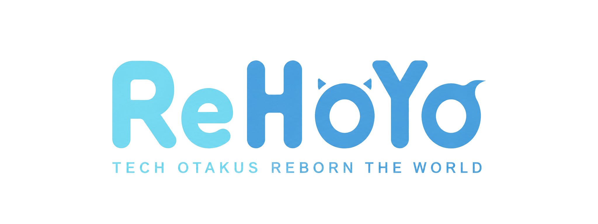

<p align="center">
  
</p>

<h1 align="center">ReHoYo 全球玩家洞察指挥中心</h1>

<p align="center">
  由多个专业 AI Agent 组成的全球游戏玩家研究团队。<br />
  在下一次版本发布前，帮助开发与运营团队理解全球玩家真正关心什么。
</p>

<p align="center">
  <a href="https://github.com/MihYux/Rehoyo/actions/workflows/ci.yml"></a>
</p>

> **概念产品 · 非官方产品**
>
> ReHoYo 只运行真实公开网络研究。每条证据必须来自本次公开网页、官方搜索接口或公开 RSS 响应，并保留 HTTPS URL、原始摘录和检索时间。没有可验证来源时任务会停止，不会生成替代评论、样本量或结论。结果不代表抽样调查或任何游戏、平台的官方结论。

## 产品概览

ReHoYo 将传统的“查看最终 AI 总结”变成可观察的多 Agent 研究流程。用户可以创建一次全球玩家分析任务，并实时查看四名 Agent 如何采集证据、分析情绪、比较地区差异并生成版本策略。

- **社区研究 Agent**：检索限定 Subreddit 的 Reddit RSS、Niconico 官方 Snapshot Search，以及公开中文社区页面。
- **玩家情绪 Agent**：识别正面、负面与中性观点，并追踪情绪背后的具体成因。
- **地区差异 Agent**：比较中国、日本和欧美玩家的关注重点、语言差异与文化语境。
- **策略建议 Agent**：综合上游证据，输出版本内容、宣传、本地化和风险控制建议。

## 主要体验

- 选择《原神》《崩坏：星穹铁道》《绝区零》的预设版本，或创建自定义分析任务。
- 实时观察社区研究、情绪分析、地区差异和策略综合的 Agent 协作过程。
- 在 DevTools 风格 Timeline 中回看事件、风险、交接与证据到达过程。
- 点击任意 Agent 检查任务目标、来源、数据量、中间发现与输出。
- 在研究 Dashboard 中查看情绪趋势、地区矩阵、热门关键词、争议和优先级建议。
- 使用地区与来源筛选器联动更新观点和证据。
- 向 AI 游戏顾问提问，并通过证据编号和来源 URL 回看原始公开页面。
- 将完成的任务保存在本机，重启应用后继续查看报告。

## 内置研究目标

| 游戏 | 版本 | 更新名称 |
| --- | --- | --- |
| 原神 | 5.0 | 荣花与炎日之途 |
| 崩坏：星穹铁道 | 2.0 | 假如在午夜入梦 |
| 绝区零 | 1.1 | 卧底蓝调 |

三个目标只保存游戏名、版本名、地区范围和 Agent 定义，不包含预写玩家评论、情绪比例、争议或建议。自定义游戏同样从空证据状态开始实时检索。

## 技术栈

- Electron 43（安全隔离主进程与预加载桥接）
- React 19、TypeScript、Vite 8
- Tailwind CSS v4、Motion、Radix Primitives
- Apache ECharts、Phosphor Icons
- Vitest、Testing Library、Playwright、Axe

界面使用 Noto Sans SC、Space Grotesk 与 IBM Plex Mono，并采用仅面向 `1280px` 以上桌面视口的 Operational Product 视觉系统。

## 快速开始

建议使用 Node.js 24。

```bash
npm install
npm run dev
```

`npm run dev` 会启动本地渲染服务并自动打开 **ReHoYo Electron 桌面窗口**。Vite 不会打开浏览器，产品也会拒绝新窗口与外部导航。未配置 GLM 时真实研究按钮保持锁定，不提供离线模拟回退。

常用命令：

```bash
npm start          # 构建后直接运行桌面应用
npm run package    # 生成未安装的 Windows 应用目录
npm run dist       # 生成 Windows 安装程序
npm run test       # 单元与组件测试
npm run test:e2e   # 渲染层关键路径测试
npm run test:electron # Electron 窗口、安全策略与预加载测试
npm run check      # 单元测试与生产构建
```

`npm run dev:renderer` 仅用于渲染层隔离开发和自动化测试；它不会自动打开浏览器，也不是日常产品启动方式。

## 真实公开网络 Agent

配置 GLM 后，任务大厅启用真实研究。社区 Agent 先检索公开材料，情绪与地区 Agent 在证据到达后并行分析，策略 Agent 最后综合；完成报告及顾问回答全部基于同一批 `synthetic: false` 证据。任何检索、模型或证据完整性校验失败都会明确报错并停止任务。

当前公开来源：

- **Reddit**：限定到对应游戏 Subreddit 的公开 Atom RSS，按版本别名与发布日期窗口过滤。
- **Niconico**：官方 Snapshot Search API 返回的公开视频标题、简介、标签与互动计数。
- **中文社区**：BigModel Web Search 返回的 Bilibili、TapTap、米游社、HoYoLAB、NGA、贴吧和知乎等允许域名页面。

“证据”指可核验的公开帖子或页面标题、正文/摘要及 URL；Niconico 记录是视频页面元数据，并不等同于读取完整评论区。数量仅表示本次成功检索并通过过滤的页面数，不代表玩家总体、舆情占比或统计抽样。

### 配置 GLM 连接

ReHoYo 支持两种连接方式，配置优先级为 **应用内连接管理 > 外部文件 / 环境变量**。两种方式都不允许把 API Key 写入项目文件、Git、`localStorage` 或日志；模型端点固定为 `https://open.bigmodel.cn/api/coding/paas/v4`，渲染器不能覆盖。

#### 方式一：应用内连接管理（推荐）

应用首次启动时显示全屏连接页 [`src/features/connection/ConnectionGate.tsx`](./src/features/connection/ConnectionGate.tsx)，用户粘贴 GLM API Key 与 Endpoint 后，主进程使用 Electron `safeStorage` 在操作系统级别加密并保存到：

```text
<Electron userData>/rehoyo-connection.json
```

加密后端由操作系统提供（macOS Keychain / Windows DPAPI / Linux libsecret），文件只保存密文。渲染进程通过 [`src/desktop/bridge.ts`](./src/desktop/bridge.ts) 仅能查询连接状态、提交新凭据或清除本机配置，不能读取已保存的密钥。`safeStorage` 不可用时（例如未解锁的 Linux keyring），密钥仅保存在主进程内存中，重启后需要重新输入，**绝不降级为明文持久化**。

任务大厅提供「连接设置」入口，可修改或清除本机配置，且不会删除任务历史。设计与实施背景见 [`docs/superpowers/specs/2026-07-23-secure-first-run-connection-design.md`](./docs/superpowers/specs/2026-07-23-secure-first-run-connection-design.md) 与 [`docs/superpowers/plans/2026-07-23-secure-first-run-connection.md`](./docs/superpowers/plans/2026-07-23-secure-first-run-connection.md)。

#### 方式二：外部文件 / 环境变量（适合开发与 CI）

将密钥写到一个独立的纯文本文件（路径自选，务必放在 Git 仓库之外），再通过环境变量或被 Git 忽略的 `.rehoyo-live.json` 告知应用密钥文件的位置。密钥文件只在 Electron 主进程发起请求时读取，不进入渲染器、`localStorage` 或日志。

**macOS / Linux**：

```bash
# 1. 把密钥写到家目录（路径自选，不要放在 Git 仓库内）
echo -n "你的GLM密钥" > ~/.rehoyo/glm-api-key
chmod 600 ~/.rehoyo/glm-api-key

# 2. 在 Rehoyo/ 项目根目录创建被 Git 忽略的 .rehoyo-live.json
#    注意：JSON 不展开 ~，keyFile 必须使用绝对路径
cat > .rehoyo-live.json <<EOF
{
  "keyFile": "$HOME/.rehoyo/glm-api-key",
  "baseUrl": "https://open.bigmodel.cn/api/coding/paas/v4",
  "model": "glm-5.2"
}
EOF

# 3. 直接 npm run dev，Electron 会自动读取 .rehoyo-live.json
npm run dev
```

不想创建配置文件，也可以仅用环境变量一次性启动：

```bash
REHOYO_GLM_API_KEY_FILE="$HOME/.rehoyo/glm-api-key" \
REHOYO_GLM_BASE_URL="https://open.bigmodel.cn/api/coding/paas/v4" \
REHOYO_GLM_MODEL="glm-5.2" \
npm run dev
```

**Windows（PowerShell）**：

```powershell
$env:REHOYO_GLM_API_KEY_FILE = "C:\secure\glm-api-key.txt"
$env:REHOYO_GLM_BASE_URL = "https://open.bigmodel.cn/api/coding/paas/v4"
$env:REHOYO_GLM_MODEL = "glm-5.2"
npm run dev
```

或使用启动参数显式指定配置文件：`electron . --rehoyo-glm-config=.rehoyo-live.json`。

#### 端点与模型约束

- 模型调用固定使用 `https://open.bigmodel.cn/api/coding/paas/v4`；公开检索使用同一密钥访问独立的 `/api/paas/v4/web_search` 工具接口。
- Endpoint 精确 allowlist，渲染器不能覆盖；API Key 长度限制为 1–4096 字符，去除首尾空白后非空。
- 两种连接方式的失败都不会静默回退到演示数据：检索或鉴权失败会明确报错并停止任务。
- 接口说明参见[智谱 Coding API](https://docs.bigmodel.cn/cn/guide/develop/forge) 与[网络搜索 API](https://docs.bigmodel.cn/api-reference/%E5%B7%A5%E5%85%B7-api/%E7%BD%91%E7%BB%9C%E6%90%9C%E7%B4%A2)。

## 桌面安全边界

- 渲染层启用 `contextIsolation`、Chromium sandbox 与 Web Security。
- 禁止渲染层直接访问 Node.js。
- 新窗口与外部导航默认拒绝，不会从应用中拉起浏览器。
- 预加载层只暴露只读运行状态、受限研究任务与顾问请求桥接，不暴露密钥或文件路径。
- 研究与顾问请求均在主进程校验输入并设置超时；渲染器不能覆盖模型端点或认证信息。
- 正式运行通过 `file://` 加载本机构建产物；开发模式仅连接 `127.0.0.1`。

## 测试

首次运行渲染层浏览器测试前安装 Chromium：

```bash
npx playwright install chromium
npm run test:e2e
```

Electron 测试直接启动打包前的桌面窗口，不需要浏览器：

```bash
npm run test:electron
```

Playwright 会在 `1440×900` 和 `1920×1080` 两种桌面尺寸下验证完整流程，并通过内部测试时钟缩短等待。测试覆盖任务创建、Agent 状态依赖、检查器、Timeline、报告筛选、顾问解锁、证据回跳、键盘焦点、WCAG A/AA 审计与控制台错误。

### GitHub Actions CI

仓库通过 [`.github/workflows/ci.yml`](./.github/workflows/ci.yml) 在推送到 `main`、面向 `main` 的 Pull Request 和手动触发时执行完整验证：

- **Quality**：在 Ubuntu 与 Windows、Node.js 24 环境运行全部单元/组件测试、TypeScript 检查和生产构建。
- **Browser E2E**：在 Ubuntu Chromium 中运行 `1440×900` 与 `1920×1080` 的流程、布局与无障碍测试。
- **Electron E2E**：在 Windows 启动真实 Electron 窗口，验证安全策略、预加载桥接和外部导航拦截。
- **Diagnostics**：上传 Playwright HTML 报告及失败时产生的 trace、截图和视频，保留 14 天。

CI 不读取 `.rehoyo-live.json` 或 GLM API key，也不会访问真实玩家来源。端到端任务使用隔离的 HTTPS 测试证据夹具，避免自动化测试污染产品数据或产生外部请求。

## 路由

Electron 正式环境使用 Hash Router，使本地 `file://` 加载与刷新保持稳定。

| Hash 路径 | 页面 |
| --- | --- |
| `#/` | 任务大厅与最近任务 |
| `#/tasks/:taskId/run` | Agent 实时工作区 |
| `#/tasks/:taskId/report?tab=overview` | 全球洞察报告 |
| `#/tasks/:taskId/report?tab=regions` | 地区差异 |
| `#/tasks/:taskId/report?tab=controversies` | 争议与证据 |
| `#/tasks/:taskId/report?tab=strategy` | 策略建议 |
| `#/tasks/:taskId/advisor` | 证据型 AI 游戏顾问 |

未完成任务无法直接访问报告或顾问。运行中的页面刷新后会从头开始；已完成报告可从本地历史恢复。

## 项目结构

```text
.github/
└── workflows/ci.yml      跨平台质量检查、浏览器 E2E 与 Electron E2E

docs/
└── superpowers/specs/    已批准的产品与技术设计规格

electron/
├── main.mjs              Electron 生命周期、窗口与导航策略
├── preload.cjs           最小化、只读的安全桥接
├── glm-client.mjs        GLM 配置校验、请求净化与主进程客户端
├── research-client.mjs   公开来源检索、四 Agent 编排与实时报告派生
└── config.mjs            可测试的桌面窗口安全配置

src/
├── components/           品牌与共享界面组件
├── data/                 三个无预写反馈的真实研究目标
├── desktop/              Electron 配置契约测试
├── domain/               类型、任务引擎、顾问匹配与本地存储
├── features/
│   ├── lobby/            任务大厅
│   ├── workspace/        Agent 工作区与 Timeline
│   ├── report/           洞察 Dashboard
│   └── advisor/          证据型 AI 顾问
├── App.tsx               Hash 路由、任务会话与恢复逻辑
└── styles.css            设计 Token 与全局界面样式

tests/
├── e2e/                  渲染层桌面关键路径
├── electron/             Electron 窗口与安全边界
└── setup.ts              Vitest 测试环境
```

## 数据与状态模型

所有可见数字、图表、Agent 状态和顾问引用都来自同一组 `AnalysisEvent` 与 `EvidenceRecord`。产品数据契约将 `synthetic` 固定为 `false`，并要求每条证据具有 HTTPS URL、原始摘录和有效检索时间。报告与本地存储前还会再次执行完整性校验。

```text
待机 → 采集 → 分类 → 地区比较 → 策略综合 → 完成
```

社区研究 Agent 首先启动；情绪与地区 Agent 在证据充足后重叠工作；策略 Agent 等待上游交接后综合报告。情绪比例、地区分数、样本量、风险上限和摘要均从证据集合确定性派生。证据不足时争议与策略允许为空。只有通过校验的完成任务才会写入版本化键 `rehoyo.live.v2`；旧演示存储和损坏数据会被安全清除。

## 已批准路线图：实时 Playwright Agent 浏览器

> **尚未进入当前生产版本。** 本节描述已批准的下一阶段设计，不能视为现有功能。

下一阶段将用真实 Playwright 页面帧替换当前工作区的浏览器样式摘要卡片。四个 Agent 各自维护最多四个页面：一个页面向卡片直播，三个页面在后台执行任务；正常上限为四个直播页面与十二个 headless worker。调度器会根据内存、页面延迟、限流与挑战状态在 `16 → 12 → 8 → 4` 个页面之间自动调整。

新帧只使用 120ms opacity 淡入，并遵循 `prefers-reduced-motion`。遇到 Turnstile 或类似挑战时，对应页面暂停并允许用户在 App 内手动接管；验证完成后 Agent 自动恢复。该方案不包含指纹伪装、反检测浏览器或验证码绕过。完整设计见[实时 Playwright Agent 浏览器规格](./docs/superpowers/specs/2026-07-23-live-playwright-agent-browsers-design.md)。

## 当前范围与限制

ReHoYo 只访问无需登录的公开搜索结果、公开 RSS 和官方开放搜索接口，不会绕过登录、验证码、robots 限制或平台权限。来源可用性、速率限制与历史索引覆盖会导致某地区样本为零。界面会如实显示证据不足。当前版本不包含私有评论区采集、统计代表性保证、登录权限、多人协作、移动端、PDF 导出或官方游戏素材。自动化测试使用隔离且明确命名的测试夹具，夹具不会进入生产构建或产品报告。
