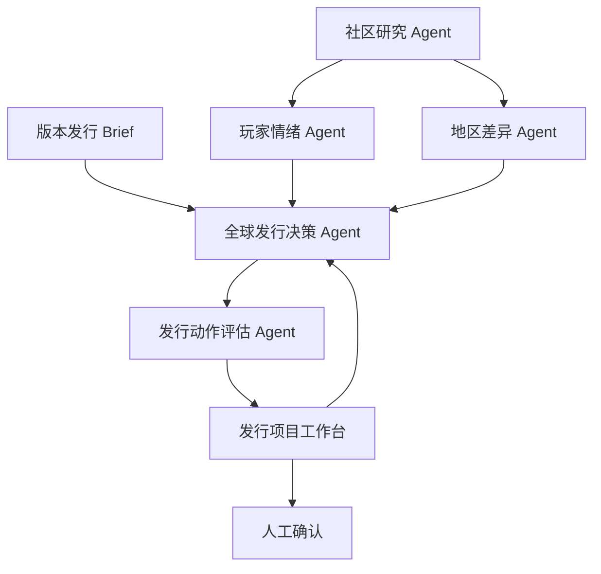

# ReHoYo 全球发行决策 Agent 改造文档

> 文档版本：v1.0  
> 改造对象：现有 ReHoYo 全球玩家洞察指挥中心  
> 改造目标：在保留真实公开网络研究与证据链的基础上，将产品升级为能够生成、评估和持续优化全球版本区域发行方案的决策 Agent。

---

## 1. 改造结论

### 1.1 新产品名称

**ReHoYo 全球版本发行决策中心**

副标题：

> 由多个专业 AI Agent 组成的全球游戏发行决策团队。  
> 在下一次版本发布前，将真实玩家证据转化为可执行、可评估、可追溯的全球区域发行方案。

### 1.2 新产品定位

ReHoYo 不再只回答：

> 不同地区的玩家正在关心什么？

而是进一步回答：

> 面对当前版本目标和全球玩家反馈，我们应该以什么为全球宣发主轴，并在中国、日本、北美等区域分别采取哪些素材、社媒、KOL、买量、联动和创新发行行动？

产品最终形成以下闭环：

> 版本 Brief → 公开玩家研究 → 区域机会与风险 → 全球宣发主轴 → 区域发行动作 → 动作评估与优化 → 最终发行方案。

### 1.3 核心交互原则

本次改造不将产品做成六步向导，也不把全部功能塞进聊天框。

采用：

> **发行项目工作台＋后台多 Agent 协作＋常驻决策助手＋关键动作人工确认。**

具体原则：

- 流程属于后台 Agent；
- 当前状态属于结构化工作台；
- 对话负责表达意图和发起修改；
- 高风险与关键决策由人确认；
- 最终发行方案是可版本化的结构化资产，不是一段聊天总结。

---

## 2. 当前产品与目标产品的差异

| 维度 | 当前 ReHoYo | 改造后 ReHoYo |
|---|---|---|
| 产品目标 | 理解全球玩家反馈 | 基于玩家证据制定全球发行方案 |
| 核心输入 | 游戏、版本、地区、公开网页 | 版本发行 Brief＋公开玩家证据 |
| 主要过程 | 采集、情绪、地区比较、策略总结 | 研究、决策、动作生成、评估、优化 |
| 核心输出 | 洞察 Dashboard 和策略建议文本 | 全球主轴、区域方案、动作清单、42天节奏 |
| 产品主对象 | 一次研究任务 | 一个持续更新的版本发行项目 |
| Agent作用 | 生成研究报告 | 维护并修改结构化发行方案 |
| 用户作用 | 查看结果、向顾问提问 | 设置约束、比较方案、确认关键动作 |
| 评估方式 | 研究证据完整性 | 证据完整性＋发行动作可行性 |
| 创新能力 | 无独立创新发行方案 | AI角色关系发行等可控实验 |
| 最终状态 | 报告完成 | 发行方案 V1.0 已确认 |

---

## 3. 必须保留的现有能力

本次改造基于现有产品增量开发，不推倒重做。

### 3.1 保留真实公开网络研究

继续保留：

- 37个公开站点目录；
- BigModel Web Search 的站点限定查询；
- Reddit 公开 Atom RSS；
- Niconico 官方 Snapshot Search；
- 游戏、版本、日期与玩家体验语义过滤；
- HTTPS URL、原始摘录和检索时间；
- `synthetic: false` 数据约束；
- 未命中显示0，不补造评论；
- 无可验证来源时停止对应研究结论。

### 3.2 保留证据一致性

以下内容仍必须来自同一组 `EvidenceRecord`：

- 玩家观点；
- 地区偏好；
- 情绪判断；
- 热门关键词；
- 争议；
- 社区讨论趋势；
- 任何声称“玩家正在关注”的事实。

### 3.3 保留Agent可观察性

继续保留：

- Agent 实时状态；
- AnalysisEvent；
- DevTools 风格 Timeline；
- Agent任务、输入、来源、中间发现与输出检查器；
- 风险、交接和证据到达过程；
- 任务失败和证据不足的明确状态。

但该Timeline从产品主流程降级为“研究运行详情”，不再作为用户日常制定发行方案的主界面。

### 3.4 保留桌面安全边界

继续保留：

- Electron `contextIsolation`；
- Chromium sandbox；
- Web Security；
- 渲染层禁止直接访问 Node.js；
- API Key 不进入项目文件、Git、localStorage或日志；
- Electron `safeStorage`；
- Endpoint allowlist；
- 受限 IPC；
- 新窗口与外部导航拒绝；
- 主进程请求校验、超时和取消；
- `file://` 正式运行与 Hash Router。

### 3.5 保留流式顾问基础能力

保留 GLM SSE 流式响应、停止生成、部分回答保留、Streamdown 渲染和证据回跳能力。

顾问需要从“报告完成后的独立问答页”升级为“发行工作台中的常驻决策助手”。

---

## 4. 新增输入：版本发行 Brief

当前产品只有公开网络研究目标，无法知道团队本版本真正追求什么。改造后，创建项目时必须增加结构化版本 Brief。

### 4.1 基础版本信息

- 游戏名称；
- 版本号；
- 更新名称；
- 预计上线时间；
- 版本周期；
- 目标区域；
- 主要语言。

### 4.2 发行目标

- 首要目标：新增／活跃／召回／营收；
- 次要目标；
- 活跃预期档位；
- 营收预期档位；
- 目标玩家范围；
- 需要重点改善的历史问题。

MVP只要求目标优先级和档位，不要求团队输入真实营收数字。

### 4.3 版本卖点

- 新角色；
- 新地图；
- 新剧情；
- 新玩法；
- 新活动；
- 联动；
- 技术或品质升级；
- 其他自定义卖点。

每个卖点需要：

- 卖点名称；
- 简短说明；
- 全球优先级；
- 是否允许区域调整；
- 可使用区域；
- 关联可用资产。

### 4.4 可用发行资产

- 版本PV；
- 角色PV；
- KV；
- 实机素材；
- 音乐；
- 声优资源；
- 开发者内容；
- 线下活动资源；
- 合作品牌；
- 角色设定与审核模板。

### 4.5 执行约束

- 预算档位；
- 团队产能；
- 时间窗口；
- 渠道限制；
- 品牌和合规限制；
- 必须执行项；
- 禁止动作；
- 风险偏好；
- 是否允许创新发行测试。

### 4.6 输入来源标记

版本 Brief 不属于公开玩家证据，需要单独标记：

```ts
interface BriefFact {
  id: string;
  field: string;
  value: unknown;
  source: "user_input" | "imported_internal_brief";
  createdAt: string;
  updatedAt: string;
}
```

不得将团队输入包装为公开玩家结论。

---

## 5. 新的依据分层

为了保留当前产品的可信边界，所有可见判断必须区分以下三类。

### 5.1 公开玩家证据

来源：

- `EvidenceRecord`；
- 公开网页；
- 公开RSS；
- 官方开放搜索接口。

可以支持：

- 玩家关注点；
- 玩家情绪；
- 地区差异；
- 争议；
- 渠道内容偏好。

### 5.2 业务输入

来源：

- 用户填写的版本 Brief；
- 手动导入的内部目标和约束。

可以支持：

- 发行目标；
- 卖点优先级；
- 预算与资源；
- 必须执行项；
- 时间限制。

### 5.3 Agent判断

Agent根据公开证据与业务输入生成：

- 全球宣发主轴；
- 区域策略；
- 发行动作；
- 优先级；
- 风险判断；
- 优化建议。

Agent判断必须标记为：

```ts
type DecisionBasis =
  | "evidence_backed"
  | "brief_driven"
  | "experimental_hypothesis";
```

含义：

- `evidence_backed`：同时有公开玩家证据和版本Brief支持；
- `brief_driven`：主要根据业务目标产生，区域证据有限；
- `experimental_hypothesis`：需要小范围验证的创新假设。

### 5.4 证据不足规则

当某区域证据不足时：

- 不生成虚假的玩家比例和情绪结论；
- 不声称“当地玩家偏好某内容”；
- 可以基于版本Brief生成基础发行必做项；
- 区域差异化动作必须标记“证据不足，需验证”；
- 高成本动作自动进入人工确认；
- AI角色关系发行只能作为实验假设，不得标记为推荐全面执行。

---

## 6. 多Agent团队改造

### 6.1 社区研究 Agent

保留现有职责：

- 检索公开来源；
- 校验域名、游戏、版本、日期与玩家体验语义；
- 生成 `EvidenceRecord`；
- 输出区域证据覆盖情况；
- 报告来源失败与证据空白。

### 6.2 玩家情绪 Agent

保留现有职责，并新增：

- 识别哪些情绪成因可能影响发行表达；
- 区分对版本内容、商业化、角色、玩法和运营动作的情绪；
- 标记不适合继续放大的争议点；
- 为发行动作提供风险依据。

### 6.3 地区差异 Agent

保留现有职责，并新增：

- 将地区差异转化为可影响素材、渠道、语气和节奏的结构化结论；
- 区分“全球共识”与“区域独有信号”；
- 输出地区之间的统一项与差异项；
- 标记翻译、文化语境和渠道错配风险。

### 6.4 全球发行决策 Agent

由原“策略建议 Agent”升级而来，作为主决策 Agent。

职责：

- 读取版本Brief；
- 综合上游真实玩家证据；
- 生成全球宣发主轴；
- 确定全球统一内容与区域可调整内容；
- 生成每个区域的推广方案；
- 将方案拆解为结构化发行动作；
- 解释每项动作的目标、卖点和依据；
- 生成42天版本发行节奏；
- 判断是否适合加入AI角色关系发行。

### 6.5 发行动作评估 Agent

新增内部评估角色，不需要在前台强制显示为第五个拟人角色。

职责：

- 对每项发行动作进行结构化评估；
- 识别重复、冲突、偏离主轴和资源不可行项；
- 为低效或高风险动作生成优化建议；
- 在Brief、证据或用户修改后局部重新评估；
- 将无法自动决定的事项放入“风险与审批”。

### 6.6 Agent编排关系



---

## 7. 新的核心输出

### 7.1 全球版本发行总纲

输出：

- 首要发行目标；
- 次要发行目标；
- 全球宣发主轴；
- 全球统一核心表达；
- 核心卖点及优先级；
- 目标玩家；
- 版本整体节奏；
- 全球统一素材；
- 区域可差异化部分；
- 关键风险；
- 需要人工确认的战略决策。

全球宣发主轴示例：

> 与三月七重新踏上旅程。

### 7.2 区域推广方案

每个区域必须生成独立的结构化方案。

#### 区域基本判断

- 区域目标；
- 目标玩家；
- 区域主推卖点；
- 当地机会；
- 舆情风险；
- 推荐渠道；
- 判断置信度；
- 证据覆盖情况。

#### 区域定制化宣发素材

输出：

- 区域素材主叙事；
- PV切入点；
- KV方向；
- 短视频主题；
- 文案语气；
- 角色或玩法露出优先级；
- 需要规避的表达；
- 可复用全球资产；
- 需要新增制作的区域资产。

每条素材建议必须说明：

- 服务目标；
- 对应卖点；
- 目标玩家；
- 区域信号；
- 执行阶段；
- 成本和风险等级。

#### 社媒活动节奏

按42天版本周期输出：

- 预热期；
- 上线爆发期；
- 持续运营期；
- 长尾召回期。

每个阶段包含：

- 平台；
- 内容主题；
- 发布频次；
- 互动方式；
- 关键节点；
- 与其他动作的依赖；
- 观察指标。

#### KOL合作推广方案

输出：

- KOL类型；
- 受众类型；
- 内容形式；
- Brief方向；
- 推荐发布时间；
- 创作者数量档位；
- 头部／中腰部组合；
- 合作目标；
- 风险提示；
- 选择依据。

MVP不直接给出无法验证的具体KOL姓名或报价。只有接入真实公开KOL数据后才允许推荐具体对象。

#### 买量计划

输出：

- 目标玩家；
- 买量阶段；
- 渠道类型；
- 素材方向；
- 卖点组合；
- 测试矩阵；
- 预算档位或比例区间；
- 扩量条件；
- 停止条件；
- 需要观察的指标。

没有真实成本数据时：

- 不输出伪造CPA；
- 不输出精确LTV；
- 不预测具体收入；
- 只使用低／中／高预算档位或比例区间；
- 明确标记“需要投放数据验证”。

#### 联动合作

输出：

- 推荐联动类型；
- 适配的自然节点；
- 品牌或IP方向；
- 线上／线下形式；
- 主要目标；
- 所需资源；
- 筹备周期；
- 风险；
- 替代轻量方案。

没有真实合作资源时，不推荐未经验证的具体品牌已具备合作意向。

#### 社区运营

输出：

- 社区话题；
- UGC活动；
- 玩家共创；
- Discord／米游社／B站／X等平台互动；
- 玩家反馈回收机制；
- 争议应对；
- 社区观察指标。

### 7.3 发行动作清单

所有区域方案最终拆解为统一数据结构。

每项动作必须包含：

- 动作名称；
- 区域；
- 动作类型；
- 服务目标；
- 使用卖点；
- 目标玩家；
- 执行平台；
- 执行阶段；
- 简短执行说明；
- 前置依赖；
- 成本等级；
- 风险等级；
- 观察指标；
- 公开证据ID；
- Brief字段ID；
- 决策依据类型；
- 当前状态；
- 是否锁定；
- 是否需要人工确认。

动作类型：

```ts
type ReleaseActionType =
  | "material"
  | "social"
  | "kol"
  | "paid_media"
  | "partnership"
  | "community"
  | "character_relationship";
```

### 7.4 发行动作评估

评估不作为独立线性页面，而是发行动作的实时属性。

评估维度：

1. 目标匹配度；
2. 卖点一致性；
3. 区域适配度；
4. 证据充分度；
5. 资源可行性；
6. 渠道适配度；
7. 节奏合理性；
8. 风险可控度；
9. 可验证性。

评级：

```ts
type ActionRating =
  | "recommended"
  | "adjust_before_execution"
  | "limited_pilot"
  | "manual_review"
  | "not_recommended";
```

每项评估输出：

- 评级；
- 综合分；
- 各维度分数；
- 简短依据；
- 主要问题；
- 与其他动作的冲突；
- 建议观察指标；
- 优化建议；
- 是否要求人工确认。

评分只用于动作之间的比较，不代表真实商业效果预测。

### 7.5 优化建议

优化类型：

- 保留；
- 修改素材；
- 修改渠道；
- 调整时间；
- 合并动作；
- 降级为灰度测试；
- 替换；
- 删除；
- 补充指标；
- 增加审核与停止条件。

任何Agent修改必须展示：

> 原方案 → 发现的问题 → 优化方案 → 预期解决的问题。

用户确认后才写入当前发行方案；被锁定的动作不得自动删除。

---

## 8. AI角色关系发行方案

AI角色关系发行是区域方案中的一类创新动作，不是整个产品的主产品。

### 8.1 触发条件

全球发行决策 Agent 只有在以下条件满足时才可以提出：

- 版本卖点与某个角色强相关；
- 发行目标包含召回、活跃或角色关系维护；
- 区域玩家证据支持角色、剧情或关系内容；
- 团队允许创新发行测试；
- 具备可用角色设定和审核资源；
- 能够采用主动订阅、白名单或其他合规触达方式。

不满足条件时，输出：

> 当前版本不建议使用AI角色关系发行。

### 8.2 方案输出字段

- 推荐地区；
- 推荐角色；
- 目标玩家分群；
- 使用场景；
- 服务的发行目标；
- 关联版本卖点；
- 触达渠道；
- 触达时间；
- 内容主线；
- 角色沟通方式；
- 与官方PV、社媒和社区动作的配合；
- 灰度范围；
- 生成与审核方式；
- 玩家授权与退出机制；
- 人设一致性要求；
- 剧透和错误信息限制；
- 成本等级；
- 风险等级；
- 验证指标；
- 扩大条件；
- 降频条件；
- 停止条件。

### 8.3 默认方案结构

示例：

```text
地区：日本
角色：三月七
目标玩家：偏好剧情、超过14天未上线、主动订阅角色消息的玩家
目标：召回流失玩家
场景：角色PV发布后的补充触达
内容主线：以旅行照片延续角色关系，再自然引出新地图
灰度范围：5%白名单
生成方式：审核模板＋有限个性化
停止条件：主动退订、连续不回复、负面反馈升高、人设一致性不足
```

### 8.4 触达预览

工作台提供对比预览：

- 普通官方版本通知；
- 固定角色模板；
- AI有限个性化角色消息。

同时显示：

- 为什么选择该地区；
- 为什么选择该玩家分群；
- 为什么选择该角色；
- 使用了哪些公开区域证据；
- 哪些判断属于实验假设；
- 当前风险和停止条件。

### 8.5 安全边界

MVP不得：

- 接入真实玩家私聊；
- 自动向玩家发送消息；
- 使用未经授权的个人数据；
- 模拟拥有真实玩家长期记忆；
- 无限自由聊天；
- 自动放大灰度范围；
- 将角色消息效果包装为真实预测；
- 绕过角色监修和人工确认。

---

## 9. 新的交互逻辑

### 9.1 项目不是一次性任务

当前“一次研究任务”升级为“版本发行项目”。

一个项目包含：

- 版本Brief；
- 一次或多次公开研究运行；
- 当前证据集合；
- 全球发行总纲；
- 区域方案；
- 发行动作；
- 评估结果；
- 42天时间轴；
- 风险与审批；
- 历史方案版本。

### 9.2 用户主流程

#### 第一步：创建版本发行项目

用户选择预设游戏和版本，或创建自定义项目，填写版本Brief。

点击“开始研究并生成初版方案”后，进入发行工作台。

#### 第二步：后台Agent运行

社区研究、情绪分析和地区比较在后台运行。

用户可以：

- 查看Agent运行状态；
- 展开Timeline；
- 查看到达的证据；
- 在部分地区完成后先查看局部洞察；
- 不需要手动逐步点击每个Agent阶段。

#### 第三步：形成初版发行方案

证据达到最低完整性要求后，全球发行决策 Agent 生成：

- 全球宣发主轴；
- 区域方案；
- 发行动作；
- 42天节奏；
- AI角色关系发行建议。

#### 第四步：用户审阅与修改

用户通过工作台：

- 比较地区差异；
- 筛选发行动作；
- 查看决策依据；
- 锁定必须执行项；
- 调整预算和约束；
- 接受或拒绝Agent优化；
- 向常驻Agent提出自然语言修改。

#### 第五步：风险与人工确认

系统只集中展示：

- 高风险动作；
- 证据不足动作；
- 资源冲突；
- 偏离全球主轴的动作；
- AI角色关系发行等创新实验；
- Agent无法自行确定的事项。

#### 第六步：生成正式方案版本

用户确认后生成：

> 全球版本发行方案 V1.0

后续修改生成V1.1、V1.2，不覆盖历史版本。

### 9.3 输入变化后的局部更新

当用户修改以下内容时：

- 预算；
- 上线时间；
- 目标优先级；
- 卖点；
- 可用资产；
- 区域范围；
- 风险偏好；

Agent不得重新生成并覆盖全部内容，而应：

1. 找出受影响的区域和动作；
2. 标记过期决策；
3. 局部重新评估；
4. 生成结构化差异；
5. 等用户确认；
6. 更新当前方案版本。

---

## 10. 新界面信息架构

### 10.1 任务大厅改为项目大厅

原：

> 创建全球玩家分析任务

改为：

> 创建全球版本发行项目

项目卡展示：

- 游戏与版本；
- 上线倒计时；
- 目标区域；
- 当前方案版本；
- 研究状态；
- 高风险动作；
- 待确认事项；
- 最近更新时间。

### 10.2 发行项目工作台

#### 顶部固定状态栏

- 游戏与版本；
- 上线时间和倒计时；
- 首要发行目标；
- 全球宣发主轴；
- 当前方案版本；
- Agent运行状态；
- 待确认数量；
- 生成正式方案按钮。

#### 左侧业务对象导航

不要使用线性六步导航。

使用：

1. 发行总览；
2. 区域市场；
3. 发行动作；
4. 版本日历；
5. 风险与审批；
6. 证据与研究；
7. 方案版本。

#### 中间主工作区

根据当前业务对象展示结构化内容。

#### 右侧常驻Agent助手

Agent助手始终知道：

- 当前项目；
- 当前方案版本；
- 当前页面；
- 当前区域；
- 当前选中动作；
- 用户已锁定的约束。

支持：

- 解释决策；
- 对比区域；
- 筛选动作；
- 修改约束；
- 局部优化；
- 批量处理；
- 生成差异；
- 重新评估。

Agent对结构化方案的修改必须先生成Patch预览，用户接受后生效。

---

## 11. 各工作区详细要求

### 11.1 发行总览

展示：

- 全球宣发主轴；
- 发行目标；
- 卖点优先级；
- 中国、日本、北美区域策略摘要；
- 关键发行动作；
- 42天节奏缩略图；
- 高风险与待确认事项；
- 当前证据覆盖。

核心问题：

> 全球统一讲什么，不同区域分别怎么讲？

### 11.2 区域市场

每个区域展示：

- 真实证据覆盖；
- 玩家关注点；
- 情绪成因；
- 热门关键词；
- 争议；
- 自然节点；
- 内容偏好；
- 文化语境；
- 推荐渠道；
- 当前区域策略；
- 最近变化。

地区筛选与来源筛选继续联动证据和观点。

### 11.3 发行动作

以表格或卡片展示全部动作。

支持：

- 按区域筛选；
- 按动作类型筛选；
- 按阶段筛选；
- 按评级筛选；
- 按风险筛选；
- 按依据类型筛选；
- 锁定动作；
- 批量选择；
- 查看决策链；
- 编辑动作；
- 局部优化；
- 局部重新评估。

动作详情展示完整链路：

> 版本目标 → 版本卖点 → 区域证据 → Agent判断 → 发行动作 → 评估结果。

### 11.4 版本日历

使用42天时间轴展示：

- D-14～D-1：预热期；
- D0～D7：上线爆发期；
- D8～D28：持续运营期；
- D29～D42：长尾召回期。

需要发现：

- 内容过密；
- 同一素材冲突；
- KOL与官方内容冲突；
- 区域预热过晚；
- 长尾动作不足；
- 资源占用重叠。

### 11.5 风险与审批

只展示需要用户处理的例外：

- 高风险动作；
- 低证据动作；
- 高成本动作；
- 资源冲突；
- 主轴偏离；
- 文化与舆情风险；
- AI角色关系发行；
- Agent低置信度判断；
- 必须执行项变更。

用户可以：

- 批准；
- 拒绝；
- 要求优化；
- 锁定；
- 补充约束；
- 暂缓。

### 11.6 证据与研究

复用现有能力：

- Agent运行状态；
- Timeline；
- EvidenceRecord列表；
- 来源、地区和Agent筛选；
- 原始摘录；
- HTTPS URL；
- 检索时间；
- 证据覆盖；
- 失败与证据不足。

该区域仍是产品可信度核心，但不再是最终价值终点。

### 11.7 方案版本

展示：

- V0.1初稿；
- V0.2优化稿；
- V1.0确认稿；
- 后续版本。

每个版本包含：

- 创建时间；
- 创建人或Agent；
- 变更摘要；
- 新增动作；
- 修改动作；
- 删除动作；
- 风险变化；
- 当前有效状态。

---

## 12. 常驻Agent助手改造

### 12.1 从问答变为结构化操作

现有顾问主要输出Markdown答案。改造后需要支持两类结果：

1. **解释型回答**
   - 回答“为什么”；
   - 引用公开证据；
   - 回跳原始页面。

2. **操作型提案**
   - 修改动作；
   - 替换渠道；
   - 调整时间；
   - 重新分配预算档位；
   - 批量优化；
   - 重新评估。

操作型提案不得直接覆盖数据，需要生成：

```ts
interface StrategyPatch {
  id: string;
  projectId: string;
  targetIds: string[];
  reason: string;
  before: unknown;
  after: unknown;
  affectedRegions: string[];
  affectedActions: string[];
  riskChange: string;
  requiresApproval: boolean;
}
```

### 12.2 推荐快捷指令

- 为什么推荐这个动作？
- 比较中国、日本和北美的主推卖点；
- 只显示高风险动作；
- 找出缺少证据的建议；
- 降低北美KOL方案的预算档位；
- 调整所有与版本PV冲突的动作；
- 保留该动作并重新评估；
- 为日本区生成AI角色关系发行灰度方案；
- 检查当前方案是否偏离全球宣发主轴。

### 12.3 引用规则

顾问回答中的玩家事实继续使用EvidenceRecord引用。

对于Agent建议，需要同时展示：

- 公开证据；
- Brief依据；
- Agent判断类型；
- 不确定性；
- 是否需要验证。

---

## 13. 数据模型增量

### 13.1 ReleaseProject

```ts
interface ReleaseProject {
  id: string;
  game: string;
  version: string;
  updateName: string;
  releaseAt: string;
  cycleDays: number;
  regions: string[];
  brief: VersionReleaseBrief;
  researchRunIds: string[];
  currentPlanVersionId?: string;
  status:
    | "brief_draft"
    | "researching"
    | "strategy_draft"
    | "review_required"
    | "approved";
  createdAt: string;
  updatedAt: string;
}
```

### 13.2 VersionReleaseBrief

```ts
interface VersionReleaseBrief {
  primaryObjective: "acquisition" | "activity" | "recall" | "revenue";
  secondaryObjectives: string[];
  activityExpectation: "low" | "medium" | "high";
  revenueExpectation: "low" | "medium" | "high";
  sellingPoints: SellingPoint[];
  availableAssets: string[];
  budgetLevel: "low" | "medium" | "high";
  teamCapacity: string[];
  mandatoryActions: string[];
  prohibitedActions: string[];
  riskPreference: "conservative" | "balanced" | "experimental";
  allowCharacterRelationshipPilot: boolean;
}
```

### 13.3 DecisionTrace

```ts
interface DecisionTrace {
  briefFactIds: string[];
  evidenceIds: string[];
  basis: DecisionBasis;
  reasoningSummary: string;
  confidence: "low" | "medium" | "high";
  limitations: string[];
  createdAt: string;
}
```

### 13.4 RegionalReleasePlan

```ts
interface RegionalReleasePlan {
  id: string;
  projectId: string;
  region: string;
  objective: string;
  audience: string[];
  primarySellingPoint: string;
  strategySummary: string;
  opportunitySummary: string;
  riskSummary: string;
  recommendedChannels: string[];
  evidenceCoverage: "insufficient" | "partial" | "sufficient";
  actionIds: string[];
  decisionTrace: DecisionTrace;
}
```

### 13.5 ReleaseAction

```ts
interface ReleaseAction {
  id: string;
  projectId: string;
  region: string;
  type: ReleaseActionType;
  title: string;
  objective: string;
  sellingPointId: string;
  audience: string[];
  channels: string[];
  stage: "preheat" | "launch" | "sustain" | "long_tail";
  startDay: number;
  endDay: number;
  description: string;
  dependencies: string[];
  costLevel: "low" | "medium" | "high";
  riskLevel: "low" | "medium" | "high";
  metrics: string[];
  decisionTrace: DecisionTrace;
  evaluation: ActionEvaluation;
  status: "draft" | "needs_review" | "approved" | "rejected";
  locked: boolean;
  requiresApproval: boolean;
}
```

### 13.6 CharacterRelationshipPlan

```ts
interface CharacterRelationshipPlan {
  actionId: string;
  character: string;
  targetRegion: string;
  targetSegment: string[];
  useCase: "recall" | "preheat" | "retention";
  channel: string;
  timing: string;
  narrativeApproach: string;
  templateMode: "reviewed_template" | "bounded_personalization";
  pilotPercentage: number;
  consentRequired: boolean;
  optOutEnabled: boolean;
  reviewRequirements: string[];
  risks: string[];
  metrics: string[];
  expandConditions: string[];
  throttleConditions: string[];
  stopConditions: string[];
}
```

### 13.7 PlanVersion

```ts
interface PlanVersion {
  id: string;
  projectId: string;
  version: string;
  globalStrategy: GlobalReleaseStrategy;
  regionalPlanIds: string[];
  actionIds: string[];
  characterRelationshipPlanIds: string[];
  changeSummary: string;
  status: "draft" | "approved" | "superseded";
  createdAt: string;
}
```

---

## 14. 状态模型改造

当前研究状态：

> 待机 → 采集 → 分类 → 地区比较 → 策略综合 → 完成

继续作为ResearchRun内部状态。

新增发行项目状态：

> Brief草稿 → 研究中 → 策略初稿 → 需要审阅 → 已确认

两者不能混为同一个状态机。

ResearchRun失败时：

- 保留已经通过校验的证据；
- 标明失败区域与来源；
- 不生成缺失区域的玩家结论；
- 允许用户重试研究；
- 已存在的版本Brief不丢失。

发行项目仍可以保留为草稿，但不能生成“已确认”正式方案。

---

## 15. 路由改造

建议新路由：

| Hash路径 | 页面 |
|---|---|
| `#/` | 版本发行项目大厅 |
| `#/projects/new` | 创建版本发行项目与Brief |
| `#/projects/:projectId/workspace?view=overview` | 发行总览 |
| `#/projects/:projectId/workspace?view=regions` | 区域市场 |
| `#/projects/:projectId/workspace?view=actions` | 发行动作 |
| `#/projects/:projectId/workspace?view=timeline` | 版本日历 |
| `#/projects/:projectId/workspace?view=review` | 风险与审批 |
| `#/projects/:projectId/workspace?view=evidence` | 证据与研究 |
| `#/projects/:projectId/workspace?view=versions` | 方案版本 |

现有：

- `#/tasks/:taskId/run`
- `#/tasks/:taskId/report`
- `#/tasks/:taskId/advisor`

可在迁移期保留为兼容路由，最终将其内容嵌入项目工作台。

---

## 16. 项目结构增量建议

在现有结构上新增：

```text
electron/
├── decision-client.mjs       # 发行决策结构化生成与校验
├── evaluation-client.mjs     # 发行动作评估与局部重评
└── research-client.mjs       # 保留现有公开研究

src/
├── domain/
│   ├── release-project.ts
│   ├── release-brief.ts
│   ├── regional-plan.ts
│   ├── release-action.ts
│   ├── decision-trace.ts
│   ├── plan-version.ts
│   └── strategy-patch.ts
├── features/
│   ├── projects/             # 项目大厅与创建
│   ├── brief/                # 版本Brief
│   ├── release-workspace/    # 全局工作台壳
│   ├── overview/             # 发行总览
│   ├── regions/              # 区域市场
│   ├── actions/              # 发行动作
│   ├── timeline/             # 42天日历
│   ├── review/               # 风险与审批
│   ├── evidence/             # 复用研究与证据
│   ├── plan-versions/        # 方案版本
│   ├── character-release/    # AI角色关系发行方案
│   └── copilot/              # 常驻发行决策助手
```

不要求完全照搬命名，但职责边界必须清晰。

---

## 17. 数据存储与迁移

建议新增版本化本地存储键：

```text
rehoyo.release.v1
```

包含：

- ReleaseProject；
- VersionReleaseBrief；
- RegionalReleasePlan；
- ReleaseAction；
- CharacterRelationshipPlan；
- PlanVersion；
- ResearchRun引用。

现有 `rehoyo.live.v2` 继续保存旧研究任务。

迁移规则：

- 旧完成任务可以导入为新项目的历史研究；
- 旧任务不自动生成版本Brief；
- 用户必须补充发行目标、卖点和约束；
- 证据仍保持原始ID、URL、摘录和时间；
- 损坏数据继续安全清除；
- 生产数据不得混入测试夹具。

---

## 18. 测试增量

### 18.1 单元与组件测试

新增覆盖：

- Brief字段校验；
- 卖点优先级；
- Evidence／Brief／Decision三类依据区分；
- DecisionTrace完整性；
- 发行动作生成；
- 评估规则；
- 锁定动作保护；
- StrategyPatch前后差异；
- AI角色关系发行触发条件；
- 证据不足降级规则；
- PlanVersion版本生成。

### 18.2 渲染层E2E

新增关键路径：

1. 创建版本发行项目；
2. 填写版本Brief；
3. 启动真实研究；
4. 查看区域证据；
5. 生成发行初稿；
6. 查看区域推广方案；
7. 筛选发行动作；
8. 查看完整决策链；
9. 锁定动作；
10. 接受Agent优化；
11. 查看42天日历同步更新；
12. 审批AI角色关系发行灰度方案；
13. 生成方案V1.0；
14. 重启后恢复项目与方案版本。

### 18.3 Electron安全测试

继续验证：

- API Key不落明文；
- 渲染层无法读取密钥；
- 外部导航拒绝；
- Endpoint不可覆盖；
- 决策与评估请求只通过受限IPC；
- 结构化Patch输入经过主进程校验；
- 渲染层不能直接写入已确认方案；
- 流式请求关闭页面后正确取消。

### 18.4 CI规则

CI继续不读取真实GLM Key、不访问真实玩家来源。

新增隔离测试夹具：

- 测试Brief；
- 测试EvidenceRecord；
- 测试区域策略；
- 测试发行动作；
- 测试AI角色关系方案。

所有夹具明确标记为测试数据，不进入生产构建和正式报告。

---

## 19. MVP范围

### 19.1 MVP必须完成

- 版本发行项目；
- 结构化版本Brief；
- 复用现有公开研究；
- 全球发行总纲；
- 中国、日本、北美区域方案；
- 区域定制化素材建议；
- 社媒活动节奏；
- KOL合作推广方案；
- 买量计划；
- 联动合作；
- 社区运营；
- 发行动作清单；
- 动作评估与局部优化；
- 42天版本日历；
- 风险与审批；
- AI角色关系发行灰度方案；
- 常驻决策助手；
- 方案版本V1.0；
- 本地持久化。

### 19.2 MVP暂不完成

- 真实预算审批；
- 精确CPA、LTV和营收预测；
- 真实KOL名单和报价；
- 自动联系KOL；
- 自动购买流量；
- 自动发布社媒；
- 真实玩家账号和行为数据；
- 真实角色私聊；
- 无限角色聊天；
- 多人协作权限；
- 官方游戏素材接入；
- PDF导出；
- 移动端；
- 已批准但尚未上线的Playwright实时浏览器路线图。

---

## 20. 分阶段实施建议

### P0：完成“洞察到方案”

- 新增版本Brief；
- 升级策略Agent为全球发行决策Agent；
- 生成全球主轴；
- 生成三个区域推广方案；
- 生成结构化发行动作；
- 展示决策依据。

### P1：完成“方案到决策”

- 新增动作评估；
- 新增局部优化；
- 新增锁定与人工确认；
- 新增风险与审批；
- 新增42天时间轴；
- 新增方案版本。

### P2：完成“创新发行尝试”

- 新增AI角色关系发行方案；
- 新增官方通知／角色模板／有限个性化对比预览；
- 新增灰度范围、审核、降频和停止条件；
- 接入常驻Agent的结构化Patch。

### P3：未来真实执行

不属于当前MVP：

- 接入企业内部数据；
- 接入真实投放和社媒系统；
- 接入KOL数据库；
- 接入玩家授权与分群；
- 建立上线后数据回收；
- 用真实结果持续优化策略。

---

## 21. 产品验收标准

### 21.1 输入

1. 用户可以创建版本发行项目；
2. 用户可以填写发行目标、卖点、资产和约束；
3. 系统明确区分公开证据和业务输入。

### 21.2 研究

4. 继续只使用真实公开网络证据；
5. 每条玩家结论可回跳原始URL；
6. 证据不足时不补造结论；
7. 现有Agent Timeline和检查器继续可用。

### 21.3 决策

8. 系统可以生成全球宣发主轴；
9. 系统可以生成中国、日本和北美区域方案；
10. 每个区域包含素材、社媒、KOL、买量、联动和社区建议；
11. 每项关键动作都能追溯到Brief与证据；
12. 无证据建议会明确标记为业务驱动或实验假设。

### 21.4 评估与优化

13. 系统可以对发行动作进行结构化评估；
14. 系统可以识别冲突、重复、资源不足和主轴偏离；
15. 用户可以锁定动作；
16. Agent优化以修改前后差异形式出现；
17. 用户确认后才写入当前方案；
18. 版本日历会同步更新。

### 21.5 AI角色关系发行

19. AI角色关系发行不是默认必选项；
20. 方案包含地区、玩家、角色、场景、灰度和停止条件；
21. 低证据情况下只能标记为实验；
22. 不接真实玩家，不自动发送消息。

### 21.6 最终方案

23. 用户可以处理高风险和待确认项；
24. 系统可以生成全球版本发行方案V1.0；
25. 后续修改生成新版本，不覆盖历史版本；
26. 重启应用后可以恢复项目、证据和方案。

---

## 22. 最终产品文案

### 产品标题

**ReHoYo 全球版本发行决策中心**

### 产品副标题

> 由多个专业AI Agent组成的全球游戏发行决策团队。  
> 在下一次版本发布前，将真实玩家证据转化为全球统一主轴下可执行、可评估、可追溯的区域发行方案。

### 产品说明

> ReHoYo基于真实公开网络研究理解不同地区玩家的关注、情绪与文化语境，并结合发行团队输入的版本目标、核心卖点和执行约束，生成中国、日本、北美等区域的素材、社媒、KOL、买量、联动与社区方案。每项发行动作都保留证据和决策链，可由Agent持续评估与优化，并在关键风险处交由发行人员确认。

### 创新能力说明

> 当版本、角色、地区和玩家证据适配时，ReHoYo还可以生成AI角色关系发行灰度方案，以受控、可审核、可退出的方式探索角色如何成为版本信息触达玩家的新渠道。

### 产品核心表达

> **从看见全球玩家，到决定全球版本应该怎么发行。**

---

## 23. 不应再采用的产品表达

本次改造后避免：

- 将“社区研究—情绪—地区—策略—评估—优化”做成用户必须逐步点击的六个页面；
- 将所有区域方案塞进连续聊天消息；
- 将多Agent拟人动画当作产品主要价值；
- 将Agent生成的策略描述成玩家事实；
- 将公开来源目录数量描述为样本量；
- 在没有真实数据时预测精确商业效果；
- 每次修改都重新覆盖整份方案；
- 让Agent未经确认直接删除关键动作；
- 将AI角色关系发行作为每个版本的固定答案。

最终界面原则：

> **流程属于Agent，状态属于工作台，决策属于人，证据贯穿始终。**
