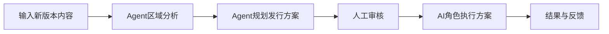

# ReHoYo 全球游戏版本区域发行 Agent PRD

> 文档版本：v1.0  
> 产品阶段：MVP  
> 产品形态：桌面端全球游戏版本发行决策与AI角色执行工作台  
> 核心链路：输入新版本内容 → Agent进行区域分析 → Agent规划全球与区域发行方案 → AI角色执行自己的发行方案

---

## 1. 产品概述

### 1.1 产品名称

**ReHoYo 全球游戏版本区域发行 Agent**

### 1.2 一句话介绍

> ReHoYo读取游戏新版本内容和发行目标，基于真实公开网络信息理解不同区域玩家，生成全球统一宣发主轴下的区域素材、社媒、KOL、买量和联动方案，并让AI游戏角色按照获批的角色关系发行方案，面向适合的区域与玩家执行自己的版本传播任务。

### 1.3 产品核心价值

传统全球版本发行需要区域团队分别完成：

- 理解版本内容；
- 研究当地玩家；
- 判断区域差异；
- 制定地区方案；
- 协调素材、社媒、KOL、买量和联动；
- 再由官方账号和广告系统向玩家传递版本信息。

ReHoYo将这条链路整合为：

1. 发行团队输入一次新版本内容；
2. Agent从公开网络中研究不同区域玩家；
3. Agent将版本卖点转化为全球主轴和区域发行方案；
4. 获得授权的AI角色根据地区和玩家关系执行角色发行任务。

产品最终要解决：

> 同一个版本，如何在保持全球品牌与叙事统一的前提下，以不同地区真正关心的方式传递给玩家，并让游戏角色成为一种新的、可控的发行触点。

---

## 2. 产品背景与机会

### 2.1 当前问题

#### 版本信息与区域玩家之间存在转译成本

开发团队提供的是：

- 新角色；
- 新剧情；
- 新地图；
- 新玩法；
- 活跃与营收目标。

区域发行团队需要将其转化为：

- 当地玩家最关心的卖点；
- 合适的语言和内容形式；
- 适配的平台与KOL；
- 区域活动节奏；
- 文化与舆情风险。

这个过程高度依赖人工经验，信息分散、重复研究、难以追溯。

#### 洞察与发行执行脱节

玩家研究通常停留在报告中，没有直接转化为：

- 素材Brief；
- 社媒活动；
- KOL任务；
- 买量测试；
- 联动合作；
- 可执行时间表。

#### 传统触达以一对多为主

版本信息通常通过：

- 官方账号；
- Push；
- 广告；
- KOL；
- 社区活动；

向玩家传播。

这些方式可以获得规模，但难以形成由角色持续承载的关系感。

### 2.2 产品机会

Agent具备三项新的产品能力：

1. 持续读取跨地区公开玩家信息；
2. 将非结构化洞察转化为结构化区域发行方案；
3. 让经过设定、监修和授权的AI角色执行有限、可审核、可停止的发行任务。

---

## 3. 产品目标与非目标

### 3.1 MVP目标

MVP需要证明：

1. 用户可以输入一个新版本的完整内容和发行目标；
2. Agent可以基于真实公开证据分析中国、日本和北美玩家；
3. Agent可以生成全球统一宣发主轴；
4. Agent可以生成三个区域的差异化发行方案；
5. 区域方案覆盖素材、社媒、KOL、买量和联动；
6. Agent可以判断AI角色关系发行是否适合当前版本和地区；
7. AI角色可以在沙盒环境中执行一套获批的发行方案；
8. 所有区域结论、策略和角色动作都可以查看依据与限制。

### 3.2 非目标

MVP暂不负责：

- 自动采购广告；
- 自动联系或签约KOL；
- 自动谈判品牌联动；
- 精确预测CPA、LTV、收入和回流；
- 直接接入真实玩家私信；
- 使用未经授权的个人玩家数据；
- 允许AI角色无限自由聊天；
- 绕过官方角色设定和内容审核；
- 替代发行负责人做最终批准；
- 建设完整的全球发行项目管理系统。

---

## 4. 目标用户

### 4.1 核心用户

| 用户 | 核心诉求 |
|---|---|
| 全球发行负责人 | 确定全球主轴，协调区域差异，控制风险 |
| 区域发行负责人 | 快速理解当地玩家并获得可执行方案 |
| 社媒运营 | 获得平台、内容、节奏和互动方案 |
| KOL运营 | 获得创作者类型、Brief和发布时间 |
| 买量团队 | 获得受众、素材方向和测试矩阵 |
| 角色内容与监修团队 | 审核AI角色的人设、表达和触达边界 |
| 开发与内容团队 | 理解哪些版本卖点被不同地区重视 |

### 4.2 核心使用场景

在版本上线前14～42天，发行团队创建一个版本发行项目，输入版本内容和目标。Agent完成区域研究与方案规划，团队审核后，AI角色在沙盒或已授权渠道中执行角色关系发行任务。

---

## 5. 核心产品链路



四个核心产品模块：

1. **版本输入**
2. **区域洞察**
3. **发行方案**
4. **角色执行**

四个模块是同一个版本发行项目中的工作区，不做成必须机械点击的线性六步向导。

---

## 6. 核心概念

### 6.1 版本发行项目

一个版本发行项目包含：

- 新版本内容；
- 发行目标；
- 公开区域证据；
- 区域洞察；
- 全球宣发主轴；
- 区域发行方案；
- 角色关系发行方案；
- AI角色执行记录。

### 6.2 全球宣发主轴

所有地区共同遵循的核心表达。

例如：

> 与三月七重新踏上旅程。

它确保不同地区没有把同一个版本传播成完全不同的产品。

### 6.3 区域发行方案

在全球宣发主轴下，根据当地玩家、渠道和文化语境产生的差异化方案。

### 6.4 AI角色关系发行

AI角色在经过授权、审核和限制的前提下，以角色身份执行版本相关传播任务。

它不是替代官方账号、KOL和广告，而是新增一种适用于：

- 版本预热；
- 角色内容传播；
- 剧情玩家维护；
- 流失玩家召回；
- 版本长尾运营；

的角色化触达方式。

---

## 7. 总体信息架构

### 7.1 项目大厅

展示：

- 游戏与版本；
- 上线时间；
- 当前阶段；
- 目标地区；
- 区域分析状态；
- 发行方案状态；
- 角色执行状态；
- 待审核事项。

### 7.2 项目工作台

顶部固定显示：

- 游戏与版本；
- 上线倒计时；
- 首要发行目标；
- 全球宣发主轴；
- 当前方案版本；
- Agent状态；
- 待审核数量；
- 暂停角色执行按钮。

左侧导航：

1. 版本输入；
2. 区域洞察；
3. 发行方案；
4. 角色执行；
5. 证据与运行记录。

右侧常驻Agent助手：

- 解释分析；
- 比较区域；
- 修改方案；
- 生成局部策略；
- 解释角色选择；
- 生成修改前后差异。

---

## 8. 模块一：输入新版本内容

### 8.1 用户目标

让Agent准确理解：

- 新版本有什么；
- 发行团队希望达成什么；
- 哪些内容最重要；
- 有哪些资产与限制。

### 8.2 输入字段

#### 基础信息

- 游戏名称；
- 版本号；
- 版本名称；
- 上线日期；
- 版本周期；
- 目标区域。

#### 版本内容

- 新角色；
- 新地图；
- 新剧情；
- 新玩法；
- 新活动；
- 联动内容；
- 技术或品质升级；
- 其他卖点。

每个卖点包含：

- 名称；
- 说明；
- 优先级；
- 是否全球统一；
- 可使用区域；
- 关联角色；
- 关联资产。

#### 发行目标

- 首要目标：新增／活跃／召回／营收；
- 次要目标；
- 目标玩家；
- 活跃预期档位；
- 营收预期档位；
- 希望改善的问题。

#### 可用资产

- 版本PV；
- 角色PV；
- KV；
- 实机视频；
- 音乐；
- 声优；
- 开发者内容；
- 角色设定；
- 线下资源；
- 合作资源。

#### 执行约束

- 预算档位；
- 时间；
- 团队产能；
- 必须执行项；
- 禁止动作；
- 渠道限制；
- 风险偏好；
- 是否允许AI角色发行；
- 可使用角色。

### 8.3 输入方式

支持：

- 结构化表单；
- 上传版本Brief；
- 在Agent对话框中补充；
- Agent将自然语言转成字段后由用户确认。

### 8.4 Agent处理

Agent需要输出：

- Brief摘要；
- 信息完整度；
- 卖点优先级；
- 目标冲突；
- 缺失信息；
- 需要用户确认的问题。

### 8.5 验收标准

- 用户可以保存版本输入；
- 卖点可以排序；
- 目标和卖点关联清晰；
- Agent不擅自补造内部信息；
- 缺少核心字段时不得开始生成正式发行方案。

---

## 9. 模块二：Agent区域分析

### 9.1 用户目标

理解中国、日本和北美玩家：

- 正在关心什么；
- 为什么产生正面或负面情绪；
- 对本版本哪些卖点更敏感；
- 适合什么内容与渠道；
- 存在哪些文化和舆情风险。

### 9.2 数据来源

沿用现有ReHoYo真实公开网络研究能力：

- 公开网页；
- 官方开放搜索接口；
- 公开RSS；
- Reddit Atom RSS；
- Niconico Snapshot Search；
- 当前已配置的公开站点目录。

每条证据必须保留：

- HTTPS URL；
- 原始标题；
- 原始摘录；
- 来源；
- 地区；
- 发布时间；
- 检索时间；
- 游戏和版本匹配结果。

### 9.3 Agent分工

#### 社区研究Agent

- 检索公开材料；
- 校验来源；
- 建立证据记录；
- 输出区域覆盖。

#### 玩家情绪Agent

- 识别正面、负面和中性观点；
- 识别情绪成因；
- 区分角色、剧情、玩法、商业化和运营争议。

#### 地区差异Agent

- 比较中国、日本和北美；
- 识别全球共识；
- 识别区域特有关注；
- 判断语言、内容和文化差异。

### 9.4 区域分析输出

每个地区输出：

- 证据覆盖；
- 玩家核心关注；
- 关键情绪及成因；
- 热门关键词；
- 对版本卖点的响应；
- 内容偏好；
- 推荐渠道；
- 自然节点；
- 主要争议；
- 文化与表达风险；
- 适合由AI角色承载的内容；
- 不适合由AI角色触达的内容；
- 结论置信度。

### 9.5 全球共识与区域差异

Agent需要将洞察分成：

#### 全球共同信号

用于确定全球宣发主轴。

#### 区域独有信号

用于确定：

- 当地主推卖点；
- 素材形式；
- 传播语气；
- 渠道；
- 节奏；
- 角色发行方式。

### 9.6 证据不足规则

证据不足时：

- 显示证据不足；
- 不生成虚假评论；
- 不补造情绪比例；
- 不将来源目录数量当成样本量；
- 不声称代表全体玩家；
- 允许继续生成基础发行必做项；
- 区域差异化建议标记为“待验证假设”；
- AI角色发行只能进入小范围实验。

### 9.7 页面交互

区域洞察页支持：

- 中国、日本、北美切换；
- 全球对比；
- 地区筛选；
- 来源筛选；
- 卖点筛选；
- 点击结论查看证据；
- 点击证据打开原始摘录和URL；
- 询问Agent“为什么”；
- 将某条洞察标记为发行方案输入。

---

## 10. 模块三：Agent规划发行方案

### 10.1 用户目标

获得一套：

- 保持全球统一；
- 区域差异明确；
- 可以被不同发行职能直接使用；
- 可以追溯依据；
- 包含AI角色关系发行；

的新版本发行方案。

### 10.2 发行决策Agent输入

输入包括：

- 版本Brief；
- 发行目标；
- 卖点优先级；
- 可用资产；
- 预算与时间约束；
- 全球玩家共识；
- 区域差异；
- 舆情风险；
- 证据置信度。

### 10.3 全球发行总纲

输出：

- 全球宣发主轴；
- 全球统一核心表达；
- 首要发行目标；
- 次要发行目标；
- 核心卖点排序；
- 目标玩家；
- 全球统一资产；
- 区域可调整部分；
- 版本整体节奏；
- 关键风险。

### 10.4 区域方案

每个地区分别输出：

- 区域目标；
- 目标玩家；
- 区域主推卖点；
- 一句话区域策略；
- 推荐渠道；
- 区域内容语气；
- 主要机会；
- 舆情与文化风险；
- 证据置信度；
- 需要验证的假设。

### 10.5 区域定制化素材方案

输出：

- 区域素材主叙事；
- 版本PV剪辑重点；
- 角色PV切入点；
- KV方向；
- 短视频主题；
- 文案语气；
- 角色与玩法露出优先级；
- 可复用全球资产；
- 需要新增的地区资产；
- 需要避免的表达。

### 10.6 社媒活动节奏

按版本周期输出：

| 阶段 | 时间 | 目标 |
|---|---|---|
| 预热期 | D-14～D-1 | 建立期待与核心卖点认知 |
| 上线爆发期 | D0～D7 | 集中释放内容并引导回到游戏 |
| 持续运营期 | D8～D28 | 延长讨论、UGC和玩法参与 |
| 长尾召回期 | D29～D42 | 召回未参与玩家并承接下个版本 |

每个社媒动作包含：

- 平台；
- 内容主题；
- 发布时间；
- 频次；
- 互动形式；
- 使用素材；
- 关联卖点；
- 目标玩家；
- 观察指标。

### 10.7 KOL合作推广方案

输出：

- KOL类型；
- 受众；
- 内容形式；
- 创作者层级组合；
- Brief方向；
- 发布时间；
- 合作目标；
- 关联卖点；
- 风险。

MVP不在缺少真实数据时虚构：

- KOL报价；
- 确定档期；
- 合作意愿；
- 精确转化能力。

### 10.8 买量计划

输出：

- 目标玩家；
- 渠道类型；
- 投放阶段；
- 素材方向；
- 卖点组合；
- A/B测试矩阵；
- 预算档位；
- 扩量条件；
- 停止条件；
- 观察指标。

缺少真实投放数据时，不输出精确CPA、LTV、收入或回流预测。

### 10.9 联动合作

输出：

- 联动方向；
- 适配的区域节点；
- 品牌或IP类型；
- 线上／线下形式；
- 目标；
- 筹备周期；
- 资源等级；
- 风险；
- 轻量替代方案。

### 10.10 社区运营

输出：

- 社区话题；
- UGC活动；
- 玩家共创；
- 剧情讨论；
- 玩法挑战；
- 玩家反馈回收；
- 争议应对；
- 观察指标。

### 10.11 发行方案页面

页面结构：

#### 顶部

- 全球宣发主轴；
- 发行目标；
- 卖点优先级；
- 方案版本。

#### 中间

中国、日本、北美横向对比：

- 区域目标；
- 主推卖点；
- 素材；
- 社媒；
- KOL；
- 买量；
- 联动；
- AI角色。

#### 下方

- 42天时间轴；
- 风险；
- 待确认项；
- AI角色执行入口。

### 10.12 决策追溯

每个发行建议需要展示：

- 服务的发行目标；
- 使用的版本卖点；
- 对应的区域洞察；
- 公开证据；
- Agent判断；
- 不确定性；
- 是否需要验证。

---

## 11. 模块四：AI角色执行自己的发行方案

### 11.1 模块定位

这是产品最核心的创新模块。

常规素材、社媒、KOL、买量和联动由Agent规划，交给相应发行团队执行。

AI角色关系发行则由AI角色Agent在授权范围内直接执行。

### 11.2 角色执行前提

只有同时满足以下条件才允许进入执行：

- 版本卖点与角色强相关；
- 区域洞察支持角色、剧情或关系内容；
- 发行目标适合角色触达；
- 角色设定与内容模板已上传；
- 目标玩家使用获得授权的匿名分群；
- 玩家主动订阅或允许接收；
- 角色监修团队批准；
- 已设置灰度范围、频率和停止条件。

### 11.3 角色执行方案

每个AI角色拥有自己的发行任务书：

- 角色；
- 目标地区；
- 目标玩家分群；
- 服务目标；
- 关联版本卖点；
- 执行场景；
- 执行阶段；
- 触达渠道；
- 内容主线；
- 语气与人设；
- 可引用的版本信息；
- 禁止表达；
- 消息频次；
- 审核方式；
- 灰度范围；
- 观察指标；
- 扩大、降频和停止条件。

### 11.4 支持的执行场景

#### 版本预热

角色以日常、旅行、任务或世界观事件切入，逐步引出新版本。

#### 版本上线

角色发布版本相关内容，引导玩家查看PV、活动或回到游戏。

#### 持续运营

角色围绕玩家反馈、版本内容和角色经历继续释放内容。

#### 流失召回

角色面向符合条件且已授权的流失玩家，以有限、非骚扰方式发起召回。

### 11.5 支持的内容形式

MVP支持：

- 角色短消息；
- 角色旅行日记；
- 角色动态；
- 版本邀请；
- 固定选项回复；
- 经过限制的单轮回应；
- 普通官方通知与角色通知对比。

MVP不支持：

- 无限自由聊天；
- 长期无边界记忆；
- 未审核剧情创作；
- 角色主动承诺奖励；
- 角色处理客服和付费争议；
- 自动回应敏感问题。

### 11.6 内容生成模式

采用：

> 角色审核模板＋有限个性化。

内容分为三层：

#### 固定信息

不得被模型修改：

- 版本上线时间；
- 活动名称；
- 奖励信息；
- 官方链接；
- 合规提示；
- 退出入口。

#### 可控变量

允许根据地区和玩家分群调整：

- 称呼；
- 内容顺序；
- 卖点切入；
- 语言风格；
- 角色日常铺垫；
- 消息长度。

#### 禁止生成内容

- 未发布剧情；
- 虚假奖励；
- 不存在的玩法；
- 诱导付费；
- 攻击玩家；
- 敏感政治与文化表达；
- 破坏角色设定的内容。

### 11.7 角色执行流程


### 11.8 执行状态

```ts
type CharacterCampaignStatus =
  | "draft"
  | "awaiting_review"
  | "approved"
  | "scheduled"
  | "running"
  | "paused"
  | "completed"
  | "stopped";
```

### 11.9 角色执行舱

页面展示：

- 当前角色；
- 角色任务目标；
- 目标地区；
- 目标玩家；
- 当前阶段；
- 已批准内容；
- 待审核内容；
- 即将执行的内容；
- 执行时间线；
- 风险；
- 反馈；
- 暂停与停止按钮。

### 11.10 触达预览

用户可以选择地区和玩家分群，比较：

1. 普通官方通知；
2. 固定角色模板；
3. AI有限个性化角色消息。

同时展示：

- 为什么选择该角色；
- 为什么选择该地区；
- 为什么选择该玩家；
- 使用了哪些区域洞察；
- 使用了哪条角色设定；
- 哪些字段不能修改；
- 当前风险与停止条件。

### 11.11 MVP执行边界

MVP采用沙盒执行：

- 模拟玩家分群；
- 模拟授权渠道；
- 在产品内展示角色内容投放过程；
- 记录模拟的发送、打开、回复、退订和风险事件；
- 不向真实玩家或外部平台发送内容。

未来接入官方授权渠道后，才允许真实执行。

---

## 12. 常驻Agent交互

### 12.1 定位

Agent对话框不是全部产品，而是操作当前工作台的自然语言入口。

用户可以说：

- “日本玩家最关心这个版本的什么？”
- “为什么日本推荐角色关系发行？”
- “比较中国和北美的主推卖点。”
- “把北美KOL方案的预算降低一个档位。”
- “为日本剧情玩家生成三月七预热方案。”
- “把角色触达频率降低到每周一次。”
- “检查角色消息是否存在人设偏离。”

### 12.2 Agent返回形式

#### 解释型

- 文字回答；
- 证据编号；
- 来源URL；
- 决策依据。

#### 修改型

- 修改对象；
- 修改前；
- 修改后；
- 修改原因；
- 影响范围；
- 风险变化；
- 接受／拒绝按钮。

修改不得未经用户确认直接覆盖发行方案。

---

## 13. 数据与决策可信度

### 13.1 三类信息

所有信息必须标记为：

| 类型 | 来源 |
|---|---|
| 公开玩家证据 | 公开网页、RSS、开放搜索接口 |
| 版本业务输入 | 用户填写或导入的版本Brief |
| Agent判断 | 基于前两者生成的策略与动作 |

### 13.2 Agent判断类型

```ts
type DecisionBasis =
  | "evidence_backed"
  | "brief_driven"
  | "experimental_hypothesis";
```

### 13.3 角色内容追溯

每条角色执行内容保存：

- 角色任务ID；
- 发行方案ID；
- 目标区域；
- 目标玩家分群；
- 使用卖点；
- 使用区域洞察；
- 使用角色设定；
- 使用模板；
- 固定字段；
- 生成时间；
- 审核状态；
- 执行状态。

---

## 14. 核心数据模型

### 14.1 VersionReleaseBrief

```ts
interface VersionReleaseBrief {
  game: string;
  version: string;
  updateName: string;
  releaseAt: string;
  regions: string[];
  primaryObjective: "acquisition" | "activity" | "recall" | "revenue";
  secondaryObjectives: string[];
  sellingPoints: SellingPoint[];
  availableAssets: string[];
  budgetLevel: "low" | "medium" | "high";
  mandatoryActions: string[];
  prohibitedActions: string[];
  allowedCharacters: string[];
  allowCharacterCampaign: boolean;
}
```

### 14.2 RegionalInsight

```ts
interface RegionalInsight {
  region: string;
  evidenceIds: string[];
  playerPriorities: string[];
  sentimentDrivers: string[];
  sellingPointResponse: Record<string, string>;
  preferredContent: string[];
  recommendedChannels: string[];
  culturalRisks: string[];
  characterOpportunities: string[];
  confidence: "low" | "medium" | "high";
}
```

### 14.3 RegionalReleasePlan

```ts
interface RegionalReleasePlan {
  region: string;
  objective: string;
  audience: string[];
  primarySellingPoint: string;
  strategySummary: string;
  materialPlan: ReleaseAction[];
  socialPlan: ReleaseAction[];
  kolPlan: ReleaseAction[];
  paidMediaPlan: ReleaseAction[];
  partnershipPlan: ReleaseAction[];
  communityPlan: ReleaseAction[];
  characterCampaignPlan?: CharacterCampaignPlan;
}
```

### 14.4 CharacterCampaignPlan

```ts
interface CharacterCampaignPlan {
  character: string;
  region: string;
  targetSegments: string[];
  objective: string;
  sellingPoint: string;
  scenario: "preheat" | "launch" | "sustain" | "recall";
  channel: string;
  narrativeApproach: string;
  contentRules: string[];
  forbiddenTopics: string[];
  templateMode: "reviewed_template" | "bounded_personalization";
  pilotPercentage: number;
  frequencyLimit: string;
  consentRequired: boolean;
  optOutEnabled: boolean;
  metrics: string[];
  expandConditions: string[];
  throttleConditions: string[];
  stopConditions: string[];
  status: CharacterCampaignStatus;
}
```

---

## 15. 权限、审核与安全

### 15.1 自动执行

Agent可以自动：

- 搜索公开网络；
- 分析区域；
- 生成发行草案；
- 生成角色内容草案；
- 检查人设和版本事实；
- 提出优化建议。

### 15.2 必须人工确认

以下操作必须确认：

- 全球宣发主轴；
- 最终区域发行方案；
- 高预算动作；
- 高风险动作；
- AI角色任务书；
- AI角色内容模板；
- 灰度范围；
- 角色执行开始；
- 扩大角色触达范围。

### 15.3 一键停止

角色执行舱和顶部状态栏必须始终提供：

- 暂停；
- 停止；
- 降频；
- 关闭某个地区；
- 关闭某个玩家分群；
- 关闭某个角色。

### 15.4 停止条件

至少包含：

- 主动退订；
- 连续不回复；
- 负面反馈升高；
- 投诉；
- 人设偏离；
- 错误版本信息；
- 剧透；
- 频率超限；
- 敏感内容；
- 单次触达成本超过上限。

---

## 16. 产品状态

### 16.1 项目状态

```text
Brief草稿
→ 区域分析中
→ 发行方案草稿
→ 等待审核
→ 角色执行准备
→ 角色执行中
→ 已完成／已停止
```

### 16.2 失败处理

#### 区域研究失败

- 保留已验证证据；
- 显示失败来源；
- 允许重试；
- 不生成缺失地区的玩家事实。

#### 发行方案失败

- 保留区域分析；
- 允许重新生成；
- 不覆盖用户已确认内容。

#### 角色内容生成失败

- 不执行；
- 显示失败原因；
- 保留已审核内容；
- 允许重新生成。

#### 角色执行异常

- 自动暂停；
- 保留执行记录；
- 通知用户；
- 必须人工确认后恢复。

---

## 17. 成功指标

### 17.1 产品效率

- 从输入Brief到发行初稿的时间；
- 区域研究完成率；
- 发行方案字段完整率；
- 用户手动整理时间减少比例；
- Agent建议被接受比例。

### 17.2 决策质量

- 关键建议具备证据的比例；
- 无来源玩家结论数量；
- 区域方案主轴一致性；
- 高风险动作识别率；
- 用户修改后局部更新准确率。

### 17.3 角色执行

沙盒MVP阶段：

- 角色任务生成成功率；
- 角色事实准确率；
- 人设一致性通过率；
- 审核通过率；
- 停止条件触发正确率；
- 内容对比偏好。

真实接入后再统计：

- 订阅率；
- 打开率；
- 回复率；
- 回到游戏率；
- 退订率；
- 投诉率；
- 单次有效触达成本。

---

## 18. MVP范围

### 18.1 P0必须完成

- 一个版本发行项目；
- 新版本内容输入；
- 中国、日本、北美区域分析；
- 真实公开网络证据；
- 全球宣发主轴；
- 三套区域发行方案；
- 区域定制化素材；
- 社媒节奏；
- KOL方案；
- 买量计划；
- 联动合作；
- 社区运营；
- 一个AI角色关系发行方案；
- 角色执行舱；
- 角色内容生成、审核和沙盒执行；
- 执行暂停和停止；
- 常驻Agent助手；
- 证据回跳；
- 本地项目保存。

### 18.2 P1

- 多角色执行；
- 多版本项目；
- 更多地区；
- 角色模板管理；
- 角色监修后台；
- 更细的玩家分群；
- 区域方案版本对比；
- 历史项目复用。

### 18.3 P2

- 官方社区或游戏内授权渠道；
- 真实订阅与退出；
- 真实玩家分群；
- 真实触达指标；
- 上线后反馈回流；
- 基于真实效果调整后续动作。

---

## 19. MVP验收标准

### 版本输入

1. 用户可以创建一个版本发行项目；
2. 用户可以输入目标、卖点、资产和约束；
3. Agent可以识别缺失和冲突；
4. 未确认的内部信息不会被自动补造。

### 区域分析

5. 系统可以分析中国、日本和北美；
6. 玩家结论来自真实公开证据；
7. 每条关键结论可以查看原始来源；
8. 证据不足时明确降级；
9. 可以比较三个区域对版本卖点的不同响应。

### 发行方案

10. 系统生成一个全球宣发主轴；
11. 系统生成三套区域方案；
12. 每套方案包含素材、社媒、KOL、买量、联动和社区；
13. 每项关键建议可以查看目标、卖点和区域依据；
14. 不生成虚假KOL报价、CPA、LTV和收入预测；
15. 可以展示42天发行节奏。

### AI角色执行

16. 系统可以判断是否适合角色发行；
17. 系统可以生成完整角色任务书；
18. 系统可以生成角色内容草案；
19. 固定版本信息不能被模型修改；
20. 内容需要经过人设和事实校验；
21. 未审核内容不能执行；
22. 系统可以在沙盒中执行角色任务；
23. 系统可以暂停和停止；
24. 执行记录可以追溯到发行方案和区域证据。

### 整体体验

25. 四个核心工作区可以完整走通；
26. Agent对话框可以解释和修改当前内容；
27. 修改型回答需要用户确认；
28. 项目重启后可以恢复；
29. 所有Mock执行明确标记为沙盒；
30. 产品不将实验结果包装为真实商业效果。

---

## 20. 默认演示案例

### 20.1 版本输入

```text
游戏：《崩坏：星穹铁道》
版本目标：召回流失玩家，兼顾新角色转化
核心卖点：三月七角色成长、新地图、新剧情
优先级：角色成长 > 新地图 > 新剧情
目标区域：中国、日本、北美
风险偏好：允许小范围角色关系发行
```

### 20.2 全球宣发主轴

> 与三月七重新踏上旅程。

### 20.3 区域策略

| 地区 | 主推卖点 | 主要发行方式 |
|---|---|---|
| 中国 | 角色成长与共同回忆 | 剧情二创、玩家回忆征集、社区话题 |
| 日本 | 角色关系与情感延续 | 声优内容、旅行日记、角色关系触达 |
| 北美 | 新地图与探索体验 | 世界观创作者、实机内容、社区挑战 |

### 20.4 AI角色发行

```text
角色：三月七
地区：日本
玩家：偏好剧情、超过14天未上线、主动订阅角色消息
场景：版本预热＋流失召回
内容：以旅行照片延续关系，再自然引出新地图
模式：审核模板＋有限个性化
灰度：5%沙盒白名单
停止：退订、不回复、负面反馈、人设偏离、错误信息
```

### 20.5 演示路径

1. 输入新版本内容；
2. 查看三个区域对卖点的不同响应；
3. Agent生成全球主轴和区域方案；
4. 进入日本区AI角色发行方案；
5. 查看普通通知与角色消息对比；
6. 审核并启动三月七沙盒任务；
7. 查看角色按计划执行预热、上线和召回内容；
8. 手动暂停或触发停止条件。

---

## 21. 最终产品表达

### 产品介绍

> ReHoYo是一名全球游戏版本区域发行Agent。发行团队输入新版本内容后，它会从真实公开网络中理解中国、日本和北美玩家，确定全球统一宣发主轴，生成区域素材、社媒、KOL、买量与联动方案，并让经过授权和审核的AI角色，按照自己的区域发行任务向玩家传递版本内容。

### 核心创新

> 过去，游戏角色只存在于游戏内容和官方物料中；现在，角色可以在Agent制定的发行策略下，成为一个理解地区语境、遵守人设、可审核、可停止的版本发行执行者。

### 核心链路

> **输入版本 → 理解区域 → 制定发行 → 角色执行。**

### Pitch表达

> **我们不只让AI告诉发行团队玩家在想什么，也不只让AI写一份发行策划案。我们让AI从版本内容出发，理解全球玩家、制定区域策略，并最终让游戏角色亲自完成属于自己的发行任务。**
