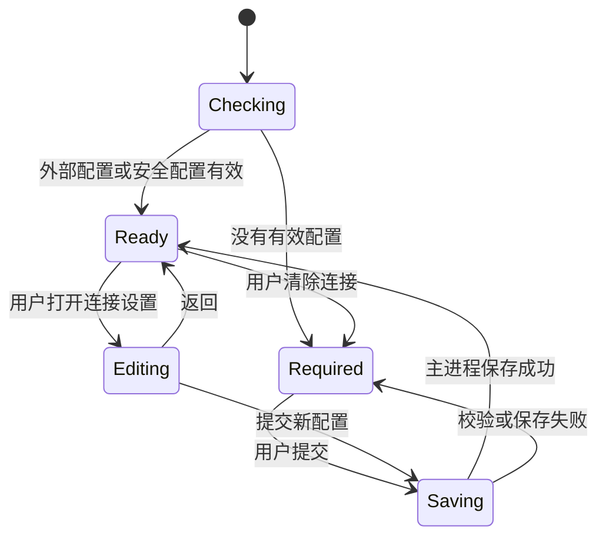

# ReHoYo 安全首次连接设计

日期：2026-07-23

状态：待用户审核
范围：Electron 首次启动连接门、凭据存储、IPC 边界与最小化启动体验

## 1. 背景与目标

ReHoYo 只使用真实公开网页与真实模型服务，不应在缺少 API 配置时进入一个看似可运行、实际只能生成占位结果的界面。应用首次启动时需要先展示一个全屏连接页，让用户粘贴 GLM API Key 和 API Endpoint；连接配置完成后再进入任务大厅。

这项改动的目标是：

- 将首次连接变成一个清晰、单任务、低认知负担的启动步骤。
- API Key 不进入项目文件、Git、浏览器存储或日志。
- 持久化凭据必须由 Electron 主进程使用操作系统保护的 `safeStorage` 加密。
- 渲染进程只能查询连接状态和提交新凭据，不能读取已保存的明文密钥。
- 保持现有命令行、环境变量与外部 key-file 配置方式可用，便于开发和自动化测试。
- 不修改 Agent 的研究逻辑、报告逻辑或数据模型。

## 2. 不在本次范围内

- 不新增云端账户、团队权限或远程密钥托管。
- 不支持任意模型供应商或任意 API Endpoint。
- 不在连接页发起计费模型请求来验证密钥。
- 不重构任务大厅、报告和顾问的完整幻灯片式 UX；该工作在连接门完成后单独实施。
- 不把 API Key 传给 React 状态管理、localStorage、sessionStorage 或 IndexedDB。

## 3. 用户体验

### 3.1 首次启动

应用完成 Electron 主进程初始化后，渲染层先进入 `checking` 状态。主进程返回“未配置”时，显示覆盖整个应用窗口的白色全屏连接页。

页面只呈现：

1. API Key 密码输入框。
2. API Endpoint 输入框，默认值为 `https://open.bigmodel.cn/api/coding/paas/v4`。
3. 主操作“连接并进入”。

辅助信息只保留一句：密钥将由操作系统加密保存在此设备，不会写入项目或上传到 ReHoYo 服务。Logo、产品名和一句欢迎语用于建立上下文，但不增加新的选择。

页面采用当前产品的白色、扁平化视觉语言。进入与退出只做 120–160ms 的透明度变化，并在 `prefers-reduced-motion` 下关闭动画。焦点顺序为 API Key、Endpoint、提交按钮；回车可提交；错误紧邻对应输入或提交区显示。

### 3.2 保存成功

用户提交后：

- 按钮进入 `saving` 状态，禁止重复提交。
- 渲染层通过受限 IPC 将两项值发送到主进程。
- 主进程验证、加密并持久化配置。
- IPC 只返回脱敏后的配置状态，不返回 API Key。
- 渲染层立即清空密码输入框和任何临时变量。
- 连接页淡出，任务大厅淡入。

保存动作不发起模型请求，因此“连接成功”表示格式有效且凭据已安全交给主进程，并不保证密钥仍有效。第一次真实研究请求若返回鉴权错误，现有错误面板应明确提示用户更新连接配置。

### 3.3 后续启动与修改连接

存在可解密的安全配置时，应用跳过连接页并进入任务大厅。

任务大厅顶部提供一个低优先级“连接设置”入口。它打开同一个全屏页，但：

- 不回显已保存密钥。
- Endpoint 可显示当前值。
- 用户必须输入新密钥才能覆盖旧配置。
- 提供一个次级“返回”动作；首次启动时不提供返回或跳过。

提供“清除本机连接”动作时需要二次确认。确认后主进程删除加密配置并清空内存中的凭据，界面回到首次连接页。此动作不会删除任务历史。

## 4. 配置来源与优先级

主进程按以下顺序解析配置：

1. 有效的命令行、环境变量或现有外部 key-file 配置。
2. Electron `userData` 目录中的安全配置。
3. 未配置，展示首次连接页。

外部 key-file 仅作为开发者显式配置继续存在。连接页不会创建或修改该文件。如果显式外部配置无效，主进程记录不含路径内容和密钥的安全诊断信息，然后尝试安全配置；两者都不可用时进入未配置状态。

允许的 Endpoint 首版固定为：

```text
https://open.bigmodel.cn/api/coding/paas/v4
```

输入框保留是为了让用户明确连接目标并满足现场演示配置需求，但主进程必须执行精确 allowlist 校验。这样可以避免把密钥发送到任意地址，也与现有 GLM 客户端约束一致。

## 5. 安全存储

### 5.1 文件位置与格式

安全配置位于：

```text
<Electron userData>/rehoyo-connection.json
```

该路径不在仓库内。文件只包含：

```ts
interface StoredConnectionV1 {
  version: 1
  provider: 'bigmodel'
  endpoint: 'https://open.bigmodel.cn/api/coding/paas/v4'
  model: 'glm-5.2'
  encryptedApiKey: string // safeStorage 密文的 base64 表示
  updatedAt: string
}
```

明文 API Key 不写入该 JSON。主进程使用 `safeStorage.encryptString()` 生成密文，读取时使用 `safeStorage.decryptString()`。写入采用同目录临时文件加原子替换，并在支持文件权限的平台请求仅当前用户可读写的模式。

### 5.2 `safeStorage` 不可用

应用绝不降级为明文持久化。

如果 `safeStorage.isEncryptionAvailable()` 为 `false`：

- 用户仍可选择在当前进程会话中连接。
- 主进程只在内存中持有密钥。
- 页面明确显示“本次会话有效，重启后需要重新输入”。
- 磁盘上不创建包含密钥的配置文件。

首版 Windows 发行环境应通常具备加密能力；会话模式是安全失败时的可用性兜底。

### 5.3 损坏或不可解密配置

JSON 解析失败、schema 不匹配或解密失败时：

- 不让应用崩溃。
- 将无效文件重命名为带时间戳的 `.invalid` 文件，或在重命名失败时安全忽略。
- 清除内存中的无效配置。
- 返回未配置状态并展示连接页。
- 日志只能记录错误类型，不能输出密文、明文或完整用户路径。

## 6. 进程与 IPC 边界

### 6.1 主进程职责

Electron 主进程新增 `ConnectionManager`，负责：

- 解析外部配置和安全配置。
- 验证 Endpoint、模型和 API Key 基本格式。
- 加密、解密、原子写入和清除配置。
- 在需要发起请求时提供短生命周期的 `getApiKey()`。
- 返回可安全展示的连接元数据。

模型客户端与真实研究客户端不再假定 API Key 必须来自文件。它们改为接收由主进程注入的异步 key provider：

```ts
type ApiKeyProvider = () => Promise<string>
```

现有 key-file 路径由一个兼容 provider 封装，安全存储由另一个 provider 封装。客户端请求函数不缓存、打印或序列化返回的密钥。

### 6.2 IPC 接口

Preload 只暴露以下窄接口：

```ts
interface ConnectionBridge {
  getStatus(): Promise<ConnectionStatus>
  save(input: { apiKey: string; endpoint: string }): Promise<ConnectionStatus>
  clear(): Promise<{ configured: false }>
}

interface ConnectionStatus {
  configured: boolean
  provider: 'bigmodel' | null
  endpoint: string
  endpointHost: string | null
  model: string | null
  persistence: 'encrypted' | 'session' | 'external' | 'none'
  warning?: string
}
```

`ConnectionStatus` 永远不包含 API Key、密文、key-file 路径或凭据来源的敏感细节。

IPC handler 对输入进行独立校验：

- `apiKey` 去除首尾空白后必须非空，长度限制为 1–4096 字符。
- `endpoint` 必须精确匹配 allowlist。
- 拒绝未知字段、非字符串值和超长负载。
- 错误返回稳定的用户可理解错误码，不附带原始输入。

### 6.3 渲染进程职责

React 连接页负责表单呈现、基础必填提示和状态切换。它不读取文件、不直接使用 Node API，也不调用模型 Endpoint。

API Key 在用户输入期间不可避免地短暂存在于输入元素和提交负载中。实现应避免把它放入全局 store、URL、日志、错误监控或持久化机制，并在提交完成或组件卸载时清空输入值。

## 7. 应用状态流



`Ready` 后才挂载现有路由和业务页面，因此任务大厅、工作区、报告和顾问不需要分别处理“未配置”的全屏覆盖逻辑。真实请求仍保留运行时鉴权失败处理，以覆盖密钥过期或被撤销的情况。

## 8. 错误与恢复

| 场景 | 用户看到的结果 | 系统行为 |
| --- | --- | --- |
| API Key 为空 | “请输入 API Key” | 不发送 IPC |
| Endpoint 非允许地址 | “当前版本仅支持 BigModel Coding Endpoint” | 主进程再次拒绝 |
| 加密可用 | “已安全保存在此设备” | 密文持久化 |
| 加密不可用 | “仅本次会话有效” | 只保存在主进程内存 |
| 配置文件损坏 | 首次连接页 | 隔离或忽略损坏文件 |
| 模型返回 401/403 | 真实任务错误提示和“更新连接”入口 | 不自动清除凭据 |
| IPC 不可用 | “请使用 ReHoYo 桌面应用” | 不展示可绕过的任务大厅 |

## 9. 测试策略

### 9.1 单元测试

- `ConnectionManager` 使用注入的文件系统、userData 路径和 `safeStorage` 替身测试。
- 保存后磁盘内容不能包含测试明文 API Key。
- 加密可用时可跨实例恢复；不可用时只能在当前实例恢复。
- 损坏 JSON、未知版本、解密失败都返回未配置且不崩溃。
- Endpoint allowlist、密钥长度、非字符串与未知字段全部被拒绝。
- 配置优先级为外部配置、安全配置、未配置。
- GLM 顾问和研究客户端通过注入 provider 取 key，原 key-file 流程保持兼容。

### 9.2 React 组件测试

- 未配置时只显示全屏连接页，不挂载任务大厅。
- 已配置时直接进入任务大厅。
- 表单默认展示正确 Endpoint。
- 保存期间禁用重复提交；失败时保留可修正输入；成功时清空 API Key 输入。
- 首次启动没有返回或跳过；设置模式可返回。
- 键盘操作、焦点可见性、错误关联和 reduced motion 生效。

### 9.3 Electron Playwright 测试

使用独立临时 `userData` 目录，不读取开发机真实配置：

1. 首次启动显示连接页。
2. 输入固定测试 key 与允许 Endpoint 后进入任务大厅。
3. 检查安全配置文件不存在测试明文 key。
4. 使用同一 `userData` 重启，跳过连接页。
5. 清除连接后重新显示连接页。

CI 不向真实 Endpoint 发请求，也不使用真实 API Key。

## 10. 验收标准

- 首次无配置启动时，用户只能看到清晰的全屏连接页。
- 页面同时最多提供三个核心交互，不出现任务或报告选项。
- 提交有效配置后无需重启即可进入任务大厅。
- Windows 正常环境下重启应用无需重新输入密钥。
- 仓库、localStorage、日志和 IPC 状态返回中均不存在明文 API Key。
- 安全配置文件不包含明文 API Key，并能由同一系统用户恢复。
- `safeStorage` 不可用时绝不写入明文，且明确告知仅会话有效。
- 现有外部 key-file 配置、真实研究、顾问和 Electron 启动测试仍通过。
- 连接门之外不改变 Agent、报告或任务引擎行为。

## 11. 后续工作

本设计审核通过后，下一步单独编写实施计划，按测试驱动顺序完成：连接管理器与存储测试、IPC 与 preload、客户端 key provider 适配、React 连接门、设置入口、Electron 端到端验证。完成该功能后再继续“每屏只展示 2–3 个选项”的完整 UX 重构。
